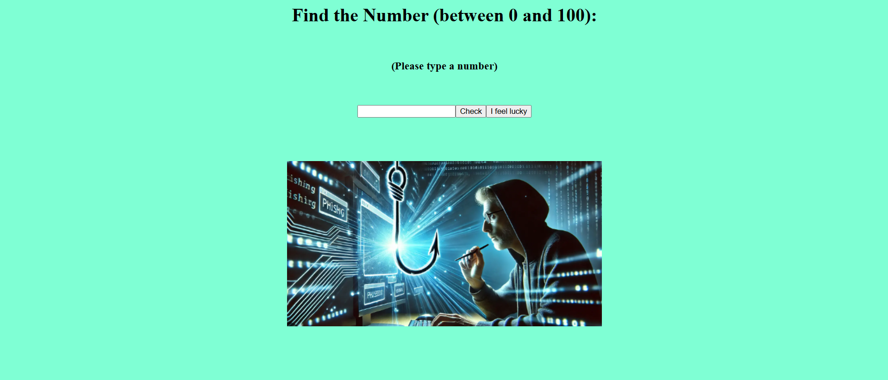

<h1 align="center">Javascript DOM</h1>

  <h3>
    <a href="https://ande-glitch.github.io/RandomNumber/">
      Link to project
    </a>
  </h3>

<!-- TABLE OF CONTENTS -->

## Table of Contents

- [Overview](#overview)
- [Built With](#built-with)
- [Features](#features)
- [How to use](#how-to-use)
- [Contact](#contact)

<!-- OVERVIEW -->
## Overview
Fun game that makes you guess a number and gives you hints along the way

## Features
- Event listeners, alerts, prompts, window.close, location.reload and math random

## How To Use

- Enter a number and guess your way through

## Contact
- GitHub [Ande-Glitch](https://github.com/Ande-glitch)
- Epost [And Nguyen](mailto:andynuwen@gmail.com)

## Result

